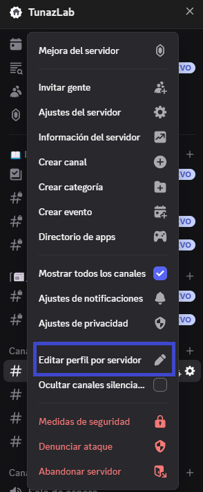
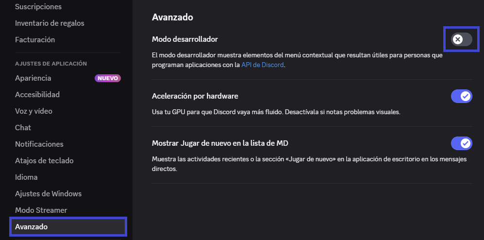
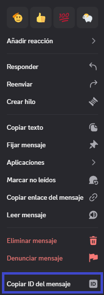

# ❓ Preguntas Frecuentes

## 🆔 Copiar IDs con comandos

### 1️⃣ Habilitar el modo desarrollador

1. Ve a tu **servidor de Discord**.
2. Haz clic en el **nombre del servidor**.
3. Selecciona **✏️ Editar perfil por servidor**.
  
4. En el menú de la izquierda, ve a **⚙️ Ajustes de aplicación → Avanzado**.
5. Activa la opción **🛠️ Modo desarrollador**.
  

### 2️⃣ Copiar IDs

Con el **modo desarrollador activado**, podrás:

* Copiar **ID de mensajes**
* Copiar **ID de usuarios**
* Copiar **ID de canales**
* Copiar **ID de roles**

📌 Para copiar un ID:

* Haz clic derecho sobre el mensaje, usuario, canal o rol.
* Selecciona **📋 Copiar ID**.

## ⚙️ Funcionamiento incorrecto de roles

Si notas que un bot no asigna o gestiona roles correctamente:

* Asegúrate de que el **rol del bot** esté **en la parte superior** de la lista de roles.
* Cuando un miembro tiene **varios roles asignados**, Discord da prioridad al que esté **más arriba** en el orden jerárquico (de arriba hacia abajo).
* Para corregirlo:

  1. Ve a **⚙️ Ajustes del servidor → Roles**.
  2. Arrastra el rol del bot hacia la parte superior.
  3. Guarda los cambios.

Esto garantiza que el bot tenga la autoridad necesaria para administrar roles y evitar conflictos de prioridad.
