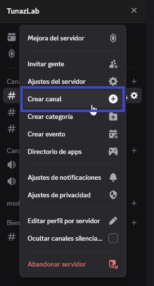

# 📝 Guía para Crear un Canal de Texto en Discord

## 1️⃣ Acceder a la creación de canal

1. Ve a tu **servidor de Discord**.
2. Haz clic en el **nombre del servidor**.
3. Selecciona la opción **➕ Crear canal**.

## 2️⃣ Configurar el canal

* Escoge la opción **💬 Canal de texto**.
* Escribe el **nombre del canal**.
* Decide si **miembros o roles específicos** podrán ver este canal.

## 3️⃣ Definir accesos

En este paso podrás elegir **quién tendrá acceso** al canal:

* 🔹 **Miembros específicos**: Usuarios individuales a los que quieres dar acceso.
* 🔹 **Roles específicos**: Grupos de usuarios con un rol concreto.

💡 **Nota**:

* Si llegaste aquí siguiendo la guía de **[🔔 Notificaciones](../notificaciones/habilitar_notificaciones.md)**, probablemente debas agregar bots como `Pingcord` para que puedan enviar avisos en este canal.
* Si necesitas que solo usuarios **verificados** tengan acceso, primero crea un **[🎭 Rol especial para verificados](../roles/permisos_verificados.md)** y selecciónalo en este paso.
