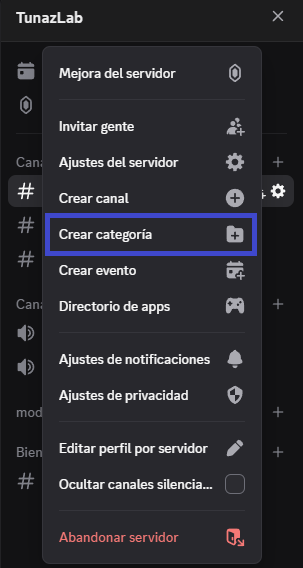
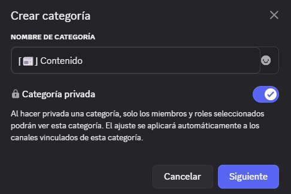

# Guía para Crear una Categoría 📂

## 1️⃣ Acceder a la creación de categoría

1. Ve a tu **servidor de Discord**.
2. Haz clic en el **nombre del servidor**.
3. Selecciona la opción **📂 Crear categoría**.



## 2️⃣ Configurar la categoría

En la ventana de creación, deberás indicar:

* **📝 Nombre de la categoría**
  Ejemplo:

  ```bash
  ⌈📰⌋ Contenido
  ```

* **🔒 Categoría privada (opcional)**

  * Si está activado: solo roles o miembros seleccionados podrán ver y acceder a los canales dentro de esta categoría.
  * Si está desactivado: la categoría y sus canales serán visibles para todos, salvo que configures permisos a nivel de canal.

## 3️⃣ Permisos heredados

Si habilitas la categoría como **privada**, podrás asignar permisos a **roles** o **miembros específicos**.

⚡ **Importante:** Los canales creados dentro de esta categoría **heredarán automáticamente** estos permisos.



Si quieres, puedo ahora **crear un solo documento unificado** con:

* Creación de roles 🎭
* Creación de canales 💬
* Creación de categorías 📂
* Explicación de permisos 🛡️
