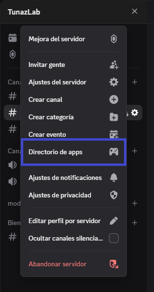
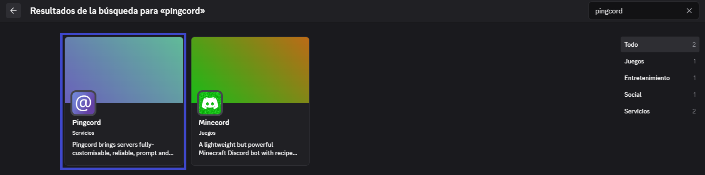
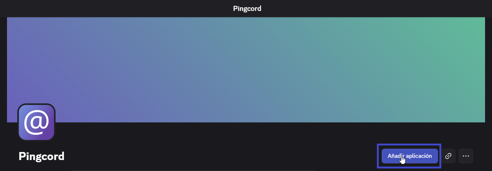
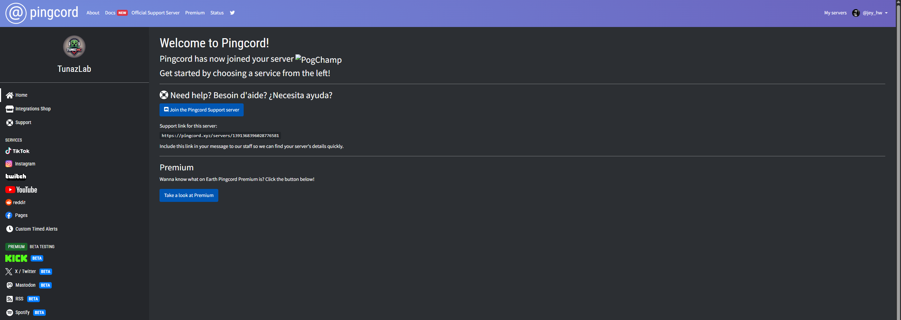
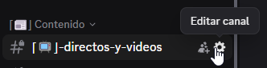
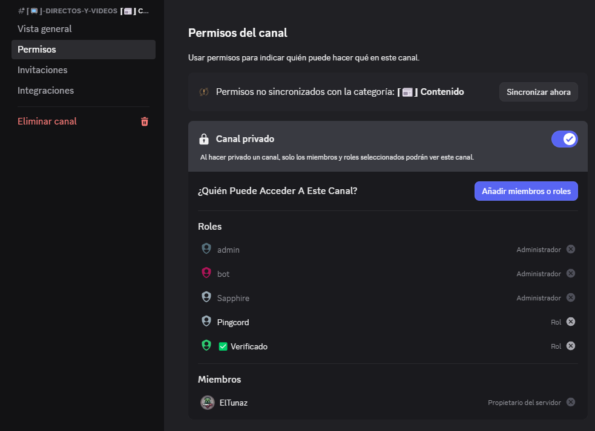
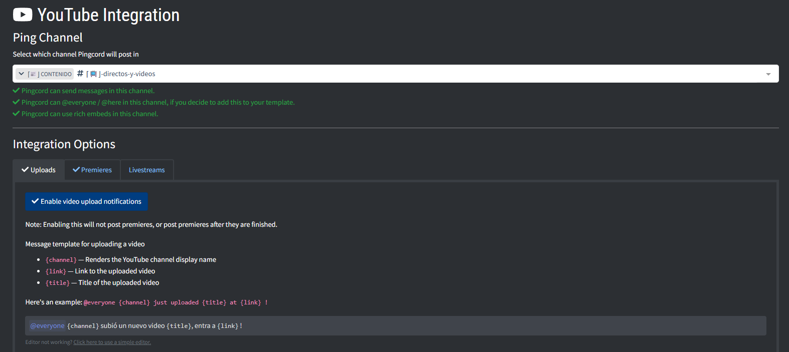

# 🔔 Guía para Configurar **Pingcord** en tu Servidor de Discord

## 1️⃣ Acceder al directorio de aplicaciones

1. Ve a tu **servidor de Discord**.
2. Haz clic en el **nombre del servidor**.
3. Selecciona **📂 Directorio de apps**.



## 2️⃣ Buscar y añadir Pingcord

1. En el buscador escribe **`pingcord`**.
2. Selecciona el primer resultado con categoría **Servicios**.
  

3. Haz clic en **➕ Añadir aplicación**.
  

## 3️⃣ Autorizar Pingcord

* Serás redirigido a la página oficial de **Pingcord**.
* Inicia sesión con tu cuenta de **Discord**.
* Selecciona el **servidor** donde quieres instalarlo.
* Autoriza los **permisos solicitados**.
* En la misma página podrás ver las integraciones disponibles:

  * 🎥 YouTube
  * 📺 Twitch
  * 📷 Instagram
  * 🎵 TikTok
  * Entre otros.



## 4️⃣ Crear canales para notificaciones

Se recomienda tener canales dedicados para que las notificaciones estén organizadas.

Ejemplos:

```bash
⌈📺⌋ Directos y Videos
⌈✂️⌋ Clips
```

📌 Para crearlos, sigue la **[guía de creación de canales de texto](../canales/canal_texto.md)**.

## 5️⃣ Asignar permisos a Pingcord en los canales

1. Haz clic en la **⚙️ Rueda de ajustes** del canal correspondiente.
  
2. Ve a la pestaña **🔐 Permisos**.
3. Añade el **rol de Pingcord** y habilita permisos para enviar mensajes.
  

## 6️⃣ Configurar integración con YouTube

1. En Pingcord, crea una **nueva integración**.
2. Selecciona **YouTube**.
3. Escoge el canal de Discord **"⌈📺⌋ Directos y Videos"** como destino.
4. Activa notificaciones para:

   * 📡 Streams en vivo
   * 🎬 Estrenos
   * 📹 Nuevos videos
5. Personaliza el mensaje de aviso.
6. Coloca la **URL del canal de YouTube** en la parte inferior.



## 7️⃣ Integración con TikTok

* Sigue la **misma mecánica** que con YouTube.
* Usa el canal **"⌈✂️⌋ Clips"** como destino.

## 📌 Extra: Autoroles automáticos

Puedes complementar el sistema de notificaciones con un **sistema de autoroles**.
Revisa este tutorial:

* [¡Crea un Sistema de Autoroles en Discord Fácil y Rápido!](https://www.youtube.com/watch?v=FndI9qMEdvU)
