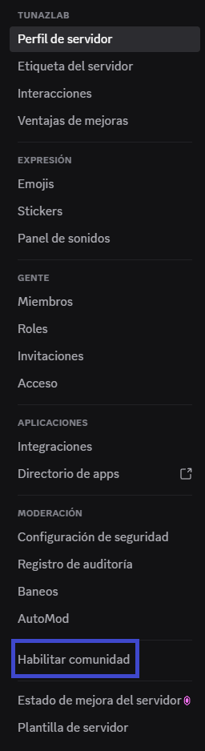
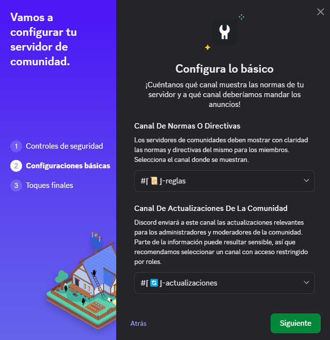
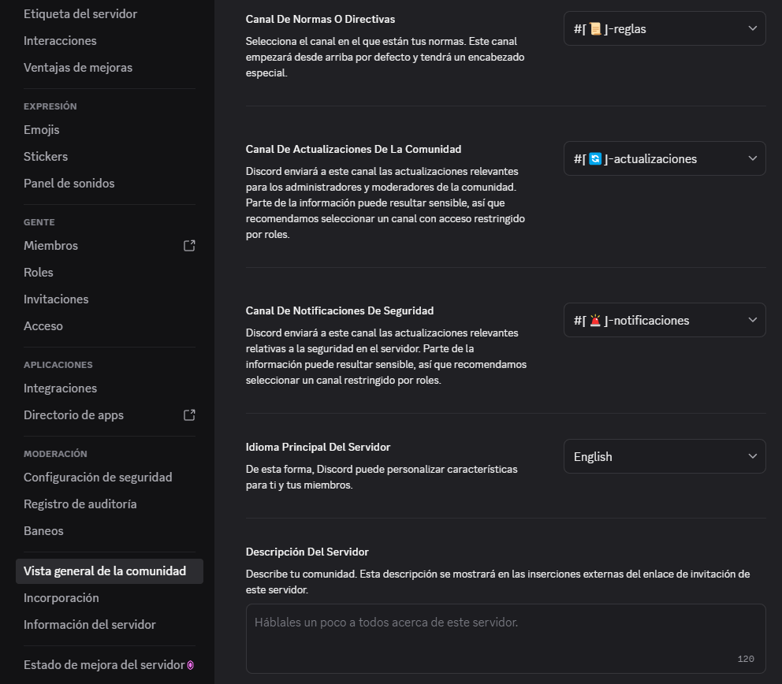

# Guía para Habilitar la Comunidad en Discord 🌐

## 1️⃣ Preparar canales y roles

Antes de habilitar la comunidad, se recomienda tener listos los canales y roles que usarás.
Puedes crearlos siguiendo estas guías:

* 📂 **[Crear categoría](../canales/crear_categoria.md)**
* 💬 **[Crear canal de texto](../canales/canal_texto.md)**
* 🎭 **[Crear rol](../roles/crear_rol.md)**

**Recomendación inicial:**

📂 **Categoría**

```bash
⌈📖⌋ Información
```

💬 **Canales**

```bash
⌈📜⌋ Reglas
⌈🔄⌋ Actualizaciones
```

💡 El canal **Actualizaciones** se recomienda como **privado**, accesible solo para administradores o moderadores.
Para esto puedes crear un rol especial, por ejemplo:

```bash
🛠️ Control
```

Este rol debe incluir permisos como **"Ver canales"** y gestión de mensajes para supervisar la comunicación interna.

## 2️⃣ Acceder a los ajustes del servidor

1. Ve a tu servidor y haz clic en el **nombre del servidor**.
2. Selecciona **⚙️ Ajustes del servidor**.


## 3️⃣ Activar la comunidad

* En el menú lateral, selecciona **🌐 Habilitar comunidad**.



* Pulsa **Comenzar**.
* Configura las opciones iniciales:

  * **Verificación de correo electrónico** para los miembros.
  * **Filtrado de contenido multimedia** para mantener un ambiente seguro.

## 4️⃣ Asignar canales oficiales de la comunidad

En esta sección debes seleccionar:

* 📜 **Canal de reglas** → el canal *Reglas* creado previamente.
* 🔄 **Canal de actualizaciones** → el canal *Actualizaciones* creado previamente.



## 5️⃣ Finalizar la configuración

* Acepta las condiciones marcando **"Lo acepto y entiendo"**.
* Pulsa **Finalizar configuración**.

## 6️⃣ Configuraciones adicionales recomendadas

* Crear un canal privado para **notificaciones de seguridad**, solo accesible por el rol **🛠️ Control**:

```bash
⌈🚨⌋ Notificaciones
```

* Agregar una **descripción del servidor** para informar a los miembros sobre el propósito y reglas generales.


