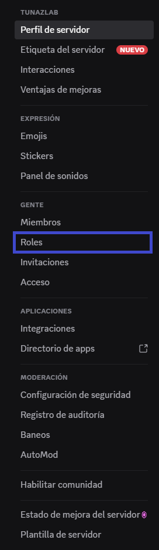

# Guía para Crear y Configurar un Rol en Discord 🛡️

## 1️⃣ Acceder a los ajustes del servidor

1. Dirígete a tu **servidor**.
2. Haz clic en el **nombre del servidor**.
3. Selecciona la opción **⚙️ Ajustes del servidor**.

## 2️⃣ Ir a la sección de Roles

* En el panel izquierdo, haz clic en **🎭 Roles**.

## 3️⃣ Crear un nuevo rol

* Presiona el botón **➕ Crear rol**.
* Al crear un rol, verás **4 paneles principales** que puedes configurar:

  1. 🎨 **Visualización**
  2. 🔐 **Permisos**
  3. 🔗 **Enlaces**
  4. 👥 **Gestionar Miembros**

## 🎨 Panel de Visualización

Aquí defines la apariencia del rol y opciones de visibilidad:

* **Nombre del rol** (ej. Moderadores, Staff, Invitados)
* **Color del rol** (afecta el color del nombre del usuario en el chat)

Opciones adicionales:

1. ✅ **Mostrar los miembros con roles por separado**

   * **Activado**: Los miembros con este rol aparecerán en una sección separada en la lista lateral con el nombre del rol como título.
     *Ejemplo:* Si el rol se llama "Moderadores", aparecerá un bloque que diga *Moderadores* con sus miembros debajo.
   * **Desactivado**: Los miembros se mezclarán con el resto en línea.

2. 🔔 **Permitir que cualquiera mencione (@mention) este rol**

   * **Activado**: Cualquier miembro puede escribir `@NombreDelRol` para notificar a todos con ese rol.
   * **Desactivado**: Solo quienes tengan permiso especial podrán mencionarlo.
     Esto ayuda a **evitar spam** o menciones innecesarias.

## 🔐 Panel de Permisos

En este apartado defines **qué puede y qué no puede hacer** este rol.
Para entender cada permiso y decidir si lo habilitas, revisa la **[🛡️ Explicación de permisos](./permisos.md)**.

## 🔗 Panel de Enlaces

Permite asociar **cuentas externas** a este rol, por ejemplo:

* 🎮 Battle.net
* 🎵 Spotify
* 💻 GitHub

Esto puede servir para sincronizar beneficios o accesos especiales.

## 👥 Panel de Gestionar Miembros

En este apartado puedes:

* Buscar miembros específicos
* Asignarles este rol directamente
* Quitarles el rol si es necesario
