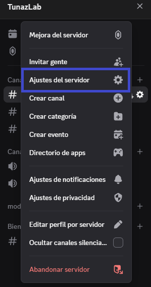

Se crea un nuevo rol para ello se puede seguir la guia de [crear roles](./crear_rol.md) y si se quieren saber más sobre los permisos se puede leer [explicacion de permisos](./permisos.md):

Se crea un rol como:

```bash
✅ Verificado
```

Se peuden habilitar los permisos:

| Nombre del Permiso                     | Estado | Nota / Explicación                                               |
| -------------------------------------- | ------ | ---------------------------------------------------------------- |
| Ver canales                            | ✅      | Necesario para que puedan ver los canales habilitados a ese rol. |
| Cambiar apodo                          | ✅      | Opcional, permite que se pongan un alias dentro del servidor.    |
| Crear invitación                       | ✅      | Opcional en caso de que se quieran crear invitaciones.           |
| Enviar mensajes y crear publicaciones  | ✅      | Permite escribir en chats y foros.                               |
| Enviar mensajes en hilos/publicaciones | ✅      | Permite responder y participar en hilos o publicaciones.         |
| Insertar enlaces                       | ✅      | Permite compartir links con vista previa.                        |
| Adjuntar archivos                      | ✅      | Permite enviar imágenes, videos o documentos.                    |
| Añadir reacciones                      | ✅      | Permite reaccionar con emojis a mensajes.                        |
| Usar emojis externos                   | ➖      | Opcional, requiere Nitro.                                        |
| Usar stickers externos                 | ➖      | Opcional, requiere Nitro.                                        |
| Leer historial de mensajes             | ✅      | Permite ver mensajes anteriores antes de unirse.                 |
| Conectar                               | ✅      | Permite unirse a canales de voz.                                 |
| Hablar                                 | ✅      | Permite usar el micrófono en canales de voz.                     |
| Usar comandos de aplicaciones          | ✅      | Permite usar comandos de bots y apps integradas.                 |

se debe crear tener los canales en privado de tal modo que se pueden crear los canales para poder habilitar

para este ejemplo se trabajará en conjunto para [crear un canal](../canales/crear_categoria.md) y creando un caales para [notificacion de contenido](../notificaciones/habilitar_notificaciones.md) dentro de la categoría sin embargo previamente se debe poder habilitar reglas y comunidad para ello se puede seguir la guia para [habilitar comunidad](../reglas/habilitar_comunidad.md)

para verificar que tenemos todo bien hasta el momento podemos verificar que el nombre del servidor esta con un logo como engranaje con una casa y que el canal de reglas está con un simbolo diferente de los demás como "#", depues de esto iremos a ajustes de servidor clickando el nombre del servidor:



Luego iremos a la sección de "Incorporación" y le daremos click a "Echa un vistazo"


Acá veremos 5 fases en la primera fase es de seguridad:

- Proteccion contra ataques y CAPTCHA
- Protección de MD y spam
- AutoMod
- Permisos

Presionamos el botón de "entendido" y "siguiente"

segunda fases de canales predeterminados aca debemos seleccionar los canales que deberían tener para visualizar todos en un inicio
