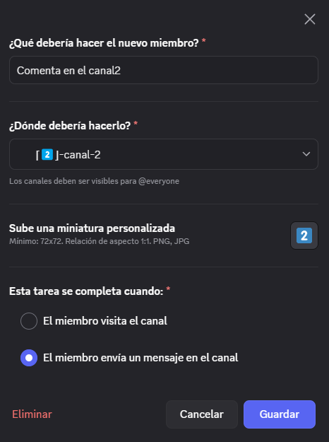
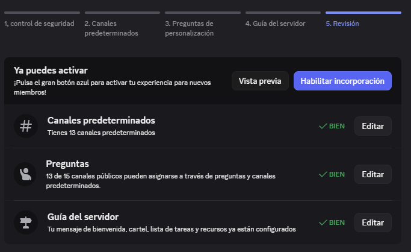

# Guía para Crear Roles Verificado y No Verificado + Configurar Incorporación de Miembros ✅

## 1️⃣ Crear roles de verificación

Para crear un rol sigue la **[guía de creación de roles](./crear_rol.md)** y, para conocer más sobre cada permiso, revisa la **[explicación de permisos](./permisos.md)**.

Roles recomendados:

```bash
✅ Verificado
❌ No Verificado
```

### Permisos sugeridos para ambos roles

*(puedes quitar algunos en "No Verificado" si lo consideras necesario)*

| Permiso                                | Estado | Explicación breve                                       |
| -------------------------------------- | ------ | ------------------------------------------------------- |
| Ver canales                            | ✅      | Necesario para que vean los canales asignados a su rol. |
| Cambiar apodo                          | ✅      | Opcional, permite cambiar su alias en el servidor.      |
| Crear invitación                       | ✅      | Opcional, para invitar nuevos miembros.                 |
| Enviar mensajes y crear publicaciones  | ✅      | Permite escribir en chats y foros.                      |
| Enviar mensajes en hilos/publicaciones | ✅      | Participar en hilos y foros.                            |
| Insertar enlaces                       | ✅      | Compartir links con vista previa.                       |
| Adjuntar archivos                      | ✅      | Subir imágenes, videos o documentos.                    |
| Añadir reacciones                      | ✅      | Reaccionar a mensajes con emojis.                       |
| Usar emojis externos                   | ➖      | Opcional, requiere Nitro.                               |
| Usar stickers externos                 | ➖      | Opcional, requiere Nitro.                               |
| Leer historial de mensajes             | ✅      | Ver mensajes previos antes de unirse.                   |
| Conectar                               | ✅      | Entrar a canales de voz.                                |
| Hablar                                 | ✅      | Usar el micrófono.                                      |
| Usar comandos de aplicaciones          | ✅      | Ejecutar comandos de bots y apps.                       |

## 2️⃣ Configurar canales privados por rol

* Los canales que usen estos roles deben estar configurados como **privados**.
* Para ello puedes crear categorías y canales siguiendo:

  * 📂 **[Crear categoría](../canales/crear_categoria.md)**
  * 💬 **[Crear canal de notificaciones](../notificaciones/habilitar_notificaciones.md)**
* Antes de continuar, asegúrate de **habilitar reglas y comunidad** con la guía:

  * 🌐 **[Habilitar comunidad](../reglas/habilitar_comunidad.md)**

## 3️⃣ Verificar la configuración inicial

1. Confirma que el **nombre del servidor** muestra un ícono de engranaje con una casa 🏠⚙️.
2. El canal de reglas debe tener un símbolo diferente (#📜).

## 4️⃣ Configurar la incorporación de miembros

1. Ve a **⚙️ Ajustes del servidor** → **🪪 Incorporación**.
2. Haz clic en **Echa un vistazo**.


### 🔹 Fase 1: Seguridad

Opciones a configurar:

* Protección contra ataques y CAPTCHA.
* Protección contra MD y spam.
* AutoMod.
* Permisos.

📌 **AutoMod**
Crea un canal para recibir alertas:

```bash
⌈🤖🚨⌋ Alertas automod
```

En la categoría "Información" y con permisos para el rol **🛠️ Control**.

Configura AutoMod para:

* Bloquear palabras en nombres de perfil.
* Bloquear contenido sospechoso de spam.
* Bloquear palabras malsonantes o de contenido sexual.
* Bloquear palabras personalizadas (puedes usar regex).

📌 **Permisos**

* Solo el **dueño del servidor** puede habilitar el requisito de **A2F** (autenticación en dos factores) para acciones de moderación.
* Revisa permisos arriesgados en `@everyone` y corrígelos.

### 🔹 Fase 2: Canales predeterminados

* Crea una categoría de **Testing** para mostrar al menos **7 canales públicos**:

```bash
⌈🧪⌋ Testing
⌈1️⃣⌋ Canal 1
⌈2️⃣⌋ Canal 2
⌈3️⃣⌋ Canal 3
⌈4️⃣⌋ Canal 4
⌈5️⃣⌋ Canal 5
⌈6️⃣⌋ Canal 6
⌈7️⃣⌋ Canal 7
```

* En la categoría "Información", crea:

```bash
⌈🌐⌋ Redes
⌈👤⌋ Verificate
```

* Estos últimos servirán para la fase 3 y 4.

### 🔹 Fase 3: Preguntas de personalización

* Ejemplo de pregunta: *"¿Me sigues en Twitch?"*
* Se puede mostrar antes o después de unirse al servidor.
* Sirve para guiar al usuario a roles o canales.

>**Nota:** Una vez realizado la verificación se puede eliminar las preguntas.

### 🔹 Fase 4: Guía del servidor

* Añade entre **3 y 5 tareas** que el usuario debe realizar al unirse.
* Ejemplos:

  * Visitar el canal `⌈👤⌋ Verificate`
  * Comentar en `⌈1️⃣⌋ Canal 1`
  * Comentar en `⌈2️⃣⌋ Canal 2`



* Agrega un cartel de bienvenida indicando quién lo envía y el mensaje.

### 🔹 Fase 5: Revisión final

* Verifica que todos los canales necesarios están creados y asignados.
* Habilita la incorporación de miembros.



## 5️⃣ Roles automáticos por preguntas

Para agregar roles automáticos según respuestas, revisa este tutorial:

* [🚀 COMO PONER ROLES AUTOMÁTICOS EN DISCORD 2025 (auto roles) *fácil y rápido*](https://www.youtube.com/watch?v=Z6sE3lL8DpU)
